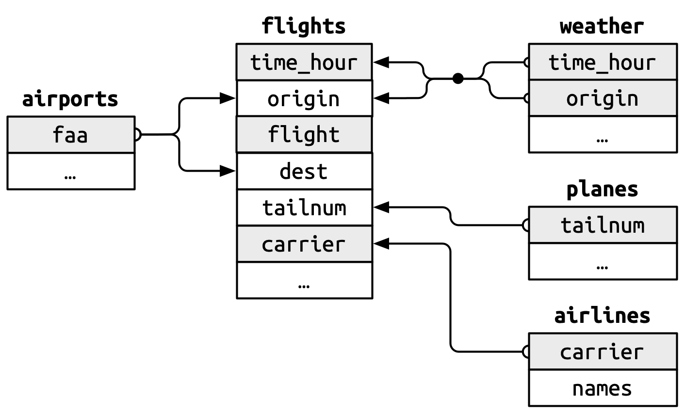

#### Set-up

```{r}
library(nycflights13)
library(dplyr)
library(ggplot2)
library(scales)
library(leaflet)


airlines <- airlines
airports <- airports
flights <- flights
planes <- planes
weather <- weather
```

------------------------------------------------------------------------

### **Question 1**

(7 points) Find the top 10 most popular destinations in the `flights` data. How many flights went to each?

-   *Airport (City): \# of Flights*
-   `ORD` (Chicago): 17283
-   `ATL` (Atlanta): 17215
-   `LAX` (Los Angeles): 16174
-   `BOS` (Boston): 15508
-   `MCO` (Orlando): 14082
-   `CLT` (Charlotte): 14064
-   `SFO` (San Francisco): 13331
-   `FLL` (Fort Lauderdale): 12055
-   `MIA` (Miami): 11728
-   `DCA` (Washington, D.C.): 9705

```{r}
## tibble
top_destinations <- flights |>
  count(dest, sort = TRUE) |>
  top_n(10) |>
  print()
## bar plot
ggplot(top_destinations, aes(x = reorder(dest, n), y = n)) +
  geom_bar(stat = "identity", fill = "dodgerblue4") +
  geom_text(aes(label = n), vjust = -0.7, size = 3.5) +
  expand_limits(y = max(top_destinations$n) * 1.1) +
  labs(title = "Top 10 Destinations from NYC in 2013",
       x = "Destination Airport",
       y = "Number of Flights") +
  theme_minimal()
```

------------------------------------------------------------------------

### **Question 2**

(10 points) Create two new categorical variables in `flights` based on the departure time (`dep_time`), and arrival time (`arr_time`). These new variables should have four categories: “early morning” for 12am to 6am, “morning” for 6am to 12pm, “afternoon” for 12pm to 6pm, and “evening” for 6pm to 12am. Show barplots of both of these new variables. What percentage of flights were “red eye” flights? We’ll define these as flights that depart in “afternoon” or “evening” and arrive in “early morning” or “morning.”

-   Percentage of red eye flights: 3.15%

```{r}
hh_mm <- function(time) {
  ifelse(is.na(time), NA, floor(time / 100))
}

flights <- flights %>%
  mutate(
    dep_hour = hh_mm(dep_time),
    arr_hour = hh_mm(arr_time),
    
    dep_period = case_when(
      dep_hour >= 0 & dep_hour < 6 ~ "early morning",
      dep_hour >= 6 & dep_hour < 12 ~ "morning",
      dep_hour >= 12 & dep_hour < 18 ~ "afternoon",
      dep_hour >= 18 & dep_hour <= 23 ~ "evening",
      TRUE ~ NA_character_
    ),
    
    arr_period = case_when(
      arr_hour >= 0 & arr_hour < 6 ~ "early morning",
      arr_hour >= 6 & arr_hour < 12 ~ "morning",
      arr_hour >= 12 & arr_hour < 18 ~ "afternoon",
      arr_hour >= 18 & arr_hour <= 23 ~ "evening",
      TRUE ~ NA_character_
    )
  )

dep_counts <- flights %>%
  count(period = dep_period) %>%
  mutate(type = "Departure")

arr_counts <- flights %>%
  count(period = arr_period) %>%
  mutate(type = "Arrival")

combined_counts <- bind_rows(dep_counts, arr_counts)

max_count <- max(combined_counts$n)

ggplot(combined_counts, aes(x = period, y = n)) +
  geom_bar(stat = "identity", aes(fill = type), show.legend = FALSE) +
  geom_text(aes(label = n), vjust = -0.5, size = 3.5) +
  expand_limits(y = max_count * 1.1) +
  facet_wrap(~ type) +
  scale_fill_manual(values = c("dodgerblue4", "#990000")) +
  scale_y_continuous(labels = label_comma()) +
  labs(title = "Flights by Time of Day",
       x = "Time Period",
       y = "Number of Flights") +
  theme_minimal() +
  theme(strip.text = element_text(size = 13, face = "bold"))

red_eye <- flights %>%
  filter(dep_period %in% c("afternoon", "evening"),
         arr_period %in% c("early morning", "morning"))

red_eye_percent <- nrow(red_eye) / nrow(flights) * 100

print(paste("Percentage of red eye flights:", round(red_eye_percent, 2), "%"))
```

------------------------------------------------------------------------

### **Question 3**

(7 points) Where there any planes that flew for multiple airlines? If so, how many were there and which airlines did they fly for?

-   There were 17 planes that flew for multiple airlines
-   These shared planes flew for either:
    -   `DL` (Delta) and `FL` (AirTran), *or*
    -   `9E` (Endeavor Air) and `EV` (ExpressJet)

```{r}
multi_airlines <- flights %>%
  filter(!is.na(tailnum), !is.na(carrier)) %>%
  distinct(tailnum, carrier) %>%
  count(tailnum) %>%
  filter(n > 1)

## How many planes flew for multiple airlines
num_planes <- nrow(multi_airlines)

print(paste("Number of planes that flew for multiple airlines:", num_planes))

## Which airlines did they fly for
planes_airlines <- flights %>%
  filter(tailnum %in% multi_airlines$tailnum) %>%
  distinct(tailnum, carrier) %>%
  arrange(tailnum)

print(planes_airlines, n = 34)

## Planes that flew for multiple airlines
multi_airlines <- flights %>%
  filter(!is.na(tailnum), !is.na(carrier)) %>%
  distinct(tailnum, carrier) %>%
  group_by(tailnum) %>%
  summarise(airlines = paste(sort(unique(carrier)), collapse = ", "),
            num_airlines = n()) %>%
  filter(num_airlines > 1)

## How many planes flew for each airline combo
combo_counts <- multi_airlines %>%
  count(airlines)

## Plot
ggplot(combo_counts, aes(x = reorder(airlines, -n), y = n)) +
  geom_bar(stat = "identity", fill = "dodgerblue4") +
  geom_text(aes(label = n), vjust = -1, size = 3.5) +
  scale_y_continuous(breaks = pretty_breaks(n = 5)) +
  expand_limits(y = 11) +
  labs(title = "Planes Flying for Multiple Airlines",
       x = "Airlines Sharing Planes",
       y = "Number of Planes") +
  theme_minimal()
```

------------------------------------------------------------------------

### **Question 4**

(7 points) In the figure, there is a missing relationship between `weather` and `airports`. What is the relationship and how should it appear in the diagram?

{fig-align="center" width="402"}

-   In the diagram, there’s a missing relationship between the `weather` and `airports` tables. Each weather observation is recorded at a specific airport, within the `origin` column in `weather`, which corresponds to the `faa` code in `airports`. This connection is important for understanding how airport-specific weather conditions affect flight delays. To show this, the diagram should include a link from `weather.origin` to `airports.faa`, just as it does for `flights.origin`. This relationship allows us to join weather data with airport data to be able to analyze which weather conditions have the most impact on delays.

```{r}
weather %>%
  left_join(airports, by = c("origin" = "faa")) %>%
  select(origin, name, time_hour, temp, wind_speed, visib)
```

------------------------------------------------------------------------

### **Question 5**

(7 points) In order to address our primary question, we want to prepare a tidy dataset (a single data frame). This will consist of information from the `flights` and `weather` data. The `year`, `month`, `day`, `hour`, and `origin` variables from `weather` provide almost enough information to give each observation a unique value. Create a new variable in the weather dataset by pasting together those 5 variables, then determine how many duplicated values there are and explain why.

Now merge the `flights` data and the `weather` data so that each flight contains information about the weather at its departure airport at the time it was scheduled to take off. You’ll want to use the variables `time_hour` and `origin` in order to do this.

-   There were 3 duplicated values, which happened because some airports recorded multiple weather observations within the same hour. For example, on November 3, 2013 at 1:00 AM, each of the three NYC airports (EWR, JFK, and LGA) recorded two separate weather entries with slight differences in temperature and wind speed. These duplicates confirm that `year`, `month`, `day`, `hour`, and `origin` are not fully reliable to identify each unique value; instead `time_hour` and `origin` are more reliable.

```{r}
weather <- weather %>%
  mutate(weather_id = paste(year, month, day, hour, origin, sep = "_"))

sum(duplicated(weather$weather_id))

flights_weather <- flights %>%
  left_join(weather, by = c("time_hour", "origin"))

flights_weather %>% select(flight, origin, time_hour, temp, wind_speed, visib) %>%
  head()

weather <- weather %>%
  mutate(weather_id = paste(year, month, day, hour, origin, sep = "_"))

weather %>%
  filter(duplicated(weather_id) | duplicated(weather_id, fromLast = TRUE)) %>%
  select(origin, year, month, day, hour, time_hour, temp, wind_speed, visib) %>%
  arrange(origin, year, month, day, hour)
```

------------------------------------------------------------------------

### **Question 6**

(20 points) On this merged dataset, perform steps 2-5 of the EDA checklist presented in class. Remember the context provided by our primary question above.

-   Step 2: The merged dataset contains 336,776 flights and 37 variables, including both flight and weather information.
-   Step 3: The dataset has a mix of numeric, character, and datetime variables. Delay variables (`dep_delay`, `arr_delay`) and weather variables (`wind_speed`, `visib`, `precip`, `temp`) are numeric. The merge added weather data to each flight using `time_hour` and `origin`.
-   Step 4: The top rows show complete flight and weather records, meaning the merge worked. The bottom rows have missing values for flights that were likely canceled or lacked departure times. These last rows may need to be filtered out later for analysis.
-   Step 5
    -   Departure Delay: Most flights had minimal delays, with a sharp drop-off as delay time increases. A small number of extreme delays occurred (over 1,000 minutes; max: 1,301 minutes).
    -   Wind Speed: The distribution is right-skewed, with most wind speeds between 5 and 15 mph. This suggests that high wind conditions are uncommon but may relate to delays.
    -   Visibility: The majority of observations report 10 miles of visibility, likely the maximum. Lower visibility readings are rare but may relate to delays.

```{r}
### Step 2
dim(flights_weather)

### Step 3
str(flights_weather)

### Step 4
head(flights_weather)
tail(flights_weather)

### Step 5
# Departure delay
ggplot(flights_weather, aes(x = dep_delay)) +
  geom_histogram(binwidth = 10, fill = "dodgerblue4") +
  geom_vline(xintercept = max(flights_weather$dep_delay, na.rm = TRUE), 
             color = "#990000", linetype = "dashed", size = 1) +
  scale_y_continuous(labels = scales::comma) +
  labs(title = "Distribution of Departure Delays", x = "Delay (min)", y = "Count") +
  theme_minimal()

max(flights_weather$dep_delay, na.rm = TRUE)

# Wind speed
ggplot(flights_weather, aes(x = wind_speed)) +
  geom_histogram(binwidth = 1, fill = "dodgerblue4") +
  scale_y_continuous(labels = scales::comma) +
  labs(title = "Distribution of Wind Speed", x = "Wind Speed (mph)", y = "Count") +
  theme_minimal()

# Visibility
ggplot(flights_weather, aes(x = visib)) +
  geom_histogram(binwidth = 1, fill = "dodgerblue4") +
  scale_y_continuous(labels = scales::comma) +
  labs(title = "Distribution of Visibility", x = "Visibility (miles)", y = "Count") +
  theme_minimal()
```

------------------------------------------------------------------------

### **Question 7**

(15 points) Calculate the average departure delay for each day (Hint: think about which variables you need in order to do this!). Which day had the worst average length of delay for departures? Now calculate the averages by day and origin. Which airport had the worst single day for delays and when was it? Now calculate the averages by hour and origin. Which airport had the worst single hour for delays (and when was it)?

-   Day with worst avg length of departure delay: 3-8-2013, 83.5 min. delay
-   Airport with worst single day for delays: LGA on 3-8-2013, 106 min. delay
-   Airport with worst single hour for delays: LGA on 7-28-2013 at 21:00, 280 min. delay

```{r}
## Avg daily dep delay
daily_avg <- flights_weather %>%
  group_by(year.x, month.x, day.x) %>%
  summarise(avg_dep_delay = mean(dep_delay, na.rm = TRUE)) %>%
  arrange(desc(avg_dep_delay))

### Worst day overall
daily_avg %>% slice(1)

daily_avg_sorted <- daily_avg %>%
  arrange(desc(avg_dep_delay)) %>%
  print(n=1)

### Graph
daily_avg %>%
  ggplot(aes(x = as.Date(paste(year.x, month.x, day.x, sep = "-")), y = avg_dep_delay)) +
  geom_line(color = "dodgerblue4") +
  labs(title = "Average Departure Delay by Day", x = "Date", y = "Avg Delay (min)") +
  theme_minimal()


## Avg dep delay by day and origin
daily_origin_avg <- flights_weather %>%
  group_by(origin, year.x, month.x, day.x) %>%
  summarise(avg_dep_delay = mean(dep_delay, na.rm = TRUE)) %>%
  arrange(desc(avg_dep_delay))

### Worst single day at any airport
daily_origin_avg %>% slice(1)

daily_origin_sorted <- daily_origin_avg %>%
  arrange(desc(avg_dep_delay)) %>%
  print(n=1)
```

```{r avg_dep_delay_day_airport, fig.width = 10, fig.height = 5}
### Graph
daily_origin_avg %>%
  mutate(date = as.Date(paste(year.x, month.x, day.x, sep = "-"))) %>%
  ggplot(aes(x = date, y = avg_dep_delay, color = origin)) +
  geom_smooth(se = FALSE, size = 1.2) +
  scale_x_date(date_labels = "%b %d", date_breaks = "2 weeks") +
  labs(title = "Smoothed Average Departure Delay by Day and Airport",
       x = "Date",
       y = "Average Delay (min)",
       color = "Airport") +
  theme_minimal(base_size = 14) +
  theme(axis.text.x = element_text(angle = 45, hjust = 1))
```

```{r}
## Avg dep delay by hour and origin
hourly_origin_avg <- flights_weather %>%
  group_by(origin, time_hour) %>%
  summarise(avg_dep_delay = mean(dep_delay, na.rm = TRUE)) %>%
  arrange(desc(avg_dep_delay))

### Worst single hour at any airport
hourly_origin_avg %>% slice(1)

hourly_origin_sorted <- hourly_origin_avg %>%
  arrange(desc(avg_dep_delay)) %>%
  print(n=1)

### Graph
hourly_origin_avg %>%
  ggplot(aes(x = time_hour, y = avg_dep_delay)) +
  geom_smooth(se = FALSE, size = 1, color = "dodgerblue4") +
  facet_wrap(~ origin, ncol = 1) +
  labs(title = "Smoothed Average Departure Delay by Hour",
       x = "Scheduled Hour",
       y = "Average Delay (min)") +
  theme_minimal(base_size = 14) +
  theme(axis.text.x = element_text(angle = 45, hjust = 1))
```

------------------------------------------------------------------------

### **Question 8**

(7 points) Compute the average delay by destination, then add that information to the `airports` data frame. Make a map showing the spatial distribution of delays (you can make it however you like, but we recommend using either `ggplot` or `leaflet`). Use the color of the points to display the average delay for each airport.

```{r}
avg_delay_dest <- flights_weather %>%
  group_by(dest) %>%
  summarise(avg_dep_delay = mean(dep_delay, na.rm = TRUE))

airport_delays <- airports %>%
  inner_join(avg_delay_dest, by = c("faa" = "dest"))

delay_pal <- colorNumeric(
  palette = colorRampPalette(c("green", "yellow2", "red"))(100),
  domain = airport_delays$avg_dep_delay
)

leaflet(data = airport_delays) %>%
  addProviderTiles("CartoDB.Positron") %>%
  addCircleMarkers(
    lng = ~lon,
    lat = ~lat,
    radius = 7,
    color = ~delay_pal(avg_dep_delay),
    fillOpacity = 2,
    label = ~paste0(name, "\nAvg Delay: ", round(avg_dep_delay, 1), " min")
  ) %>%
  addLegend(
    position = "bottomright",
    pal = delay_pal,
    values = ~avg_dep_delay,
    title = "Avg Departure Delay (min)"
  )
```

------------------------------------------------------------------------

### **Question 9**

(20 points) Finally, create as many plots and summary statistics as needed to answer the primary question above.

#### Scatterplot: Departure delay vs. wind speed

-   No clear positive correlation; wind speed doesn’t appear to cause delays directly
-   Possible inverse relationship; higher wind speeds might be associated with more predictable or controlled operations
-   Outliers at low wind speeds; are they due to other weather phenomena (e.g., fog, low visibility)?

```{r}
ggplot(flights_weather, aes(x = wind_speed, y = dep_delay)) +
  geom_point(color = "dodgerblue4", alpha = 0.2) +
  labs(title = "Departure Delay vs. Wind Speed",
       x = "Wind Speed (mph)",
       y = "Departure Delay (min)")
```

#### Boxplot: Departure delay by precipitation level

-   Delays are shortest and most consistent when there's no rain, but as precipitation increases, delays become longer and occur more often. The higher median in "Extreme" conditions suggest that heavy rain significantly disrupts flight schedules.

```{r}
flights_weather$precip_bin <- cut(flights_weather$precip,
                                  breaks = c(0, 0.01, 0.1, 0.5, 1, Inf),
                                  labels = c("None", "Light", "Moderate", "Heavy", "Extreme"),
                                  right = FALSE
)

ggplot(flights_weather, aes(x = precip_bin, y = dep_delay)) +
  geom_boxplot(fill = "dodgerblue4", alpha = 0.6) +
  labs(title = "Departure Delay by Precipitation Level",
       x = "Precipitation Category",
       y = "Departure Delay (min)")
```

#### Boxplot: Departure delay by visibility category

-   While most delays are clustered near zero, poor visibility (especially in the "Low" and "Moderate" categories) tends to have more consistent and extreme delays. Interestingly though, even "Clear" conditions show some large outliers, which suggests that visibility alone doesn't fully explain delay patterns. However, low visibility does show it can lead to delays.

```{r}
flights_weather$visib_bin <- cut(flights_weather$visib,
                                 breaks = c(0, 1, 5, 10, Inf),
                                 labels = c("Low", "Moderate", "High", "Clear"),
                                 right = FALSE
)

ggplot(flights_weather, aes(x = visib_bin, y = dep_delay)) +
  geom_boxplot(fill = "dodgerblue4", alpha = 0.6) +
  labs(title = "Departure Delay by Visibility Level",
       x = "Visibility Category",
       y = "Departure Delay (min)")
```

#### Scatterplot: Departure delays vs. temperature

-   Most flights had minimal delays across all temperature ranges, as seen by the dense cluster of points near zero. The trend line remains relatively flat, which suggests that temperature alone does not strongly influence delay duration. However, a few extreme delays appear at both low and high temperatures, which suggests that outliers may still occur during certain conditions.

```{r}
ggplot(flights_weather, aes(x = temp, y = dep_delay)) +
  geom_point(color = "dodgerblue4", alpha = 0.2) +
  geom_smooth(se = FALSE, color = "red2") +
  labs(title = "Departure Delay vs. Temperature",
       x = "Temperature (°F)",
       y = "Departure Delay (min)")
```

#### Boxplot: Departure delay by hour

-   Delays occur significantly more during early morning hours (midnight to 3 AM), with a drop in both median and IQR from mid-morning through early evening. After 8 PM, delay variability increases again. This suggests that there may certain conditions that play a significant role in delay timing.

```{r}
flights_weather$dep_hour <- as.factor(flights_weather$dep_hour)

ggplot(flights_weather, aes(x = dep_hour, y = dep_delay)) +
  geom_boxplot(fill = "dodgerblue4", alpha = 0.6) +
  labs(title = "Departure Delay by Hour",
       x = "Scheduled Departure Hour",
       y = "Departure Delay (min)")
```

#### Faceted boxplot: Departure delay by hour and precipitation level

-   Each individual boxplot with a specific precipitation category, shows that delays tend to be longer and more variable during early morning hours, especially under "Heavy" or "Extreme" precipitation. Midday and early evening flights generally experience shorter, more consistent delays.

```{r delay_hour_precip_plot, fig.width = 16, fig.height = 34}
ggplot(flights_weather, aes(x = dep_hour, y = dep_delay)) +
  geom_boxplot(fill = "dodgerblue4", alpha = 0.6, outlier.size = 0.5) +
  facet_wrap(~ precip_bin, ncol = 1) +
  labs(title = "Departure Delay by Hour and Precipitation Level",
       x = "Scheduled Departure Hour",
       y = "Departure Delay (min)") +
  theme_minimal(base_size = 28)
```

#### Faceted boxplot: Departure delay by hour and visibility level

-   Each individual boxplot shows that delays are generally longer and more variable during early morning hours, especially under low visibility conditions. Clear visibility tends to correspond with shorter, more consistent delays. The plots also show how reduced visibility can worsen delays, especially during late evening and early morning hours.

```{r delay_hour_visib_plot, fig.width = 16, fig.height = 24}
ggplot(flights_weather, aes(x = dep_hour, y = dep_delay)) +
  geom_boxplot(fill = "dodgerblue4", alpha = 0.6, outlier.size = 0.5) +
  facet_wrap(~ visib_bin, ncol = 1) +
  labs(title = "Departure Delay by Hour and Visibility Level",
       x = "Scheduled Departure Hour",
       y = "Departure Delay (min)") +
  theme_minimal(base_size = 28)
```

#### Barplot: Median delay by visibility and precipitation

-   The longest delays occurred during "moderate" visibility with "extreme" precipitation levels, followed by "low visibility" with "moderate" precipitation levels. Clearer visibility ("Clear" and "High") corresponded with generally shorter delays.
-   Thus, it is clearer that lower visibility and higher levels of precipitation may correlate to increased median departure delays.

```{r}
delay_summary <- flights_weather %>%
  group_by(visib_bin, precip_bin) %>%
  summarize(median_delay = median(dep_delay, na.rm = TRUE)) %>%
  ungroup()

ggplot(delay_summary, aes(x = visib_bin, y = median_delay, fill = precip_bin)) +
  geom_bar(stat = "identity", position = "dodge") +
  labs(title = "Median Departure Delay by Visibility and Precipitation",
       x = "Visibility Level",
       y = "Median Departure Delay (min)",
       fill = "Precipitation Level") +
  theme_minimal()
```

#### Heatmap: Median departure delay by visbility and precipitation

-   The longest delays occurred during moderate visibility with extreme precipitation, followed by low visibility with moderate precipitation. In contrast, clearer visibility levels (“Clear” and “High”) consistently correspond with shorter delays. This reinforces the potential correlation between low visibility, increased levels of precipitation, and increased departure delays.

```{r}
heatmap_data <- flights_weather %>%
  group_by(visib_bin, precip_bin) %>%
  summarize(median_delay = median(dep_delay, na.rm = TRUE)) %>%
  ungroup()

ggplot(heatmap_data, aes(x = precip_bin, y = visib_bin, fill = median_delay)) +
  geom_tile(color = "white") +
  scale_fill_gradient2(
    low = "black",
    mid = "yellow",
    high = "red",
    midpoint = 30,
    na.value = "white"
  ) +
labs(title = "Median Departure Delay by Visibility and Precipitation",
       x = "Precipitation Level",
       y = "Visibility Level",
       fill = "Median Delay (min)") +
  theme_minimal() +
  theme(axis.text.x = element_text(angle = 45, hjust = 1))
```

#### Summary statistics

-   Median delay by precipitation
    -   This tibble shows how delays increase with precipitation intensity, peaking at extreme precipitation (median delay: 65.5 minutes). Moderate and heavy precipitation also show some delays (median delay of 9-10 minutes), while dry conditions (None) correspond with generally lower delays, even early departures (median delay: –2 minutes).
-   Median delay by visibility
    -   This tibble shows that moderate visibility corresponds with the highest median delay (1 minute), while low visibility shows a neutral impact (median of 0 minute delays). Clear and high visibility levels were associated with early or on-time departures (–2 and –1 minutes, respectively).
-   Median delay by wind speed
    -   Wind speed appears to have minimal impact on median delays. All categories had median delays between –2 and –1 minutes, suggesting that wind alone may not be a strong predictor of delay.
-   Comparison table
    -   This combined table ranked weather conditions by their associated median delays. Extreme precipitation stands out as the most impactful, followed by moderate and heavy precipitation. Visibility has a mild effect, with moderate visibility showing slight delay increases. Wind speed shows no real influence, with all wind categories clustered near zero or had early departure. This suggests that precipitation is the most disruptive weather factor for flight departures.

```{r}
# Median delay by precipitation
precip_summary <- flights_weather %>%
  group_by(precip_bin) %>%
  summarize(median_delay = median(dep_delay, na.rm = TRUE)) %>%
  print()

# Median delay by visibility
visib_summary <- flights_weather %>%
  group_by(visib_bin) %>%
  summarize(median_delay = median(dep_delay, na.rm = TRUE)) %>%
  print()

# Median delay by wind speed
flights_weather <- flights_weather %>%
  mutate(wind_bin = case_when(
    wind_speed < 5 ~ "Calm",
    wind_speed < 10 ~ "Moderate",
    wind_speed < 20 ~ "Strong",
    TRUE ~ "Extreme"
  ))

wind_summary <- flights_weather %>%
  group_by(wind_bin) %>%
  summarize(median_delay = median(dep_delay, na.rm = TRUE)) %>%
  print()

# Comparison table
bind_rows(
  precip_summary %>% mutate(variable = "Precipitation", level = precip_bin),
  visib_summary %>% mutate(variable = "Visibility", level = visib_bin),
  wind_summary %>% mutate(variable = "Wind Speed", level = wind_bin)
) %>%
  select(variable, level, median_delay) %>%
  arrange(desc(median_delay))
```

#### Comparison table: Visibility, precipitation, and wind speed

-   This table shows that precipitation is the strongest factor of flight delays. The top rows all include moderate to heavy precipitation, often combined with strong wind or lower visibility. These combinations of weather factors have the highest median delays and widest IQRs. This further suggests that precipitation is the weather factor that creates delays, more than visibility or wind alone.

```{r}
combo_summary <- flights_weather %>%
  group_by(visib_bin, precip_bin, wind_bin) %>%
  summarize(
    median_delay = median(dep_delay, na.rm = TRUE),
    iqr_delay = IQR(dep_delay, na.rm = TRUE),
    count = n()
  ) %>%
  arrange(desc(median_delay))

combo_summary %>%
  slice_max(median_delay, n = 10) %>%
  arrange(desc(median_delay))
```

------------------------------------------------------------------------

### Findings

#### Primary Question

Which weather phenomena have the most impact on flight delays?

#### Conclusion

Based on the generated plots and summary statistics, precipitation appears to be the most disruptive weather factor affecting flight departure delays. While visibility and wind show modest or inconsistent effects, delays increase sharply with heavier precipitation, especially under moderate or low visibility and/or high wind speeds. Extreme precipitation (and combinations of high levels of precipitation, lower visibility, and high wind speeds) consistently had the highest median delays. Therefore, the data supports that precipitation, specifically at moderate to extreme levels, is the primary weather phenomena of flight delays.

**Overall, though, the weather phenomena with the most impact on flight delays are high levels precipitation combined with low visibility and high wind speeds.**
